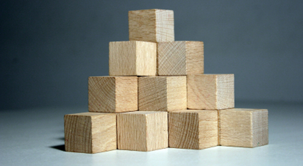
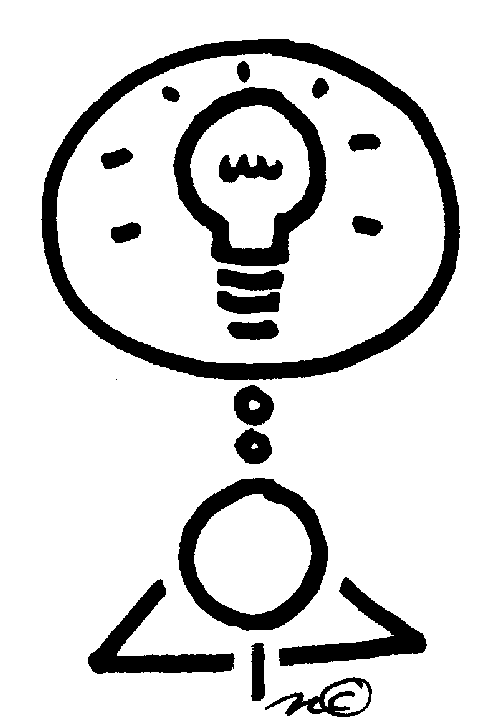

## Piece By Piece

As a kid I really enjoyed playing with building blocks such as Legos. Although I had no idea what I was doing, stacking them up was pretty enjoyable. After reading and learning what design patterns were, I feel that building blocks are a good analogy to it. Design Patterns, according to [sourcemaking.com](https://sourcemaking.com/design_patterns), "is a general reapeatable solution to a commonly occuring problem in software design." Building blocks can serve as this "repeatable solution." Each and every piece can be used to serve a different purpose in the build. Each and every piece can represent different coding functions to use in a software design problem. With building blocks you are able to build all sorts of things. If we look at different kinds of building, each block could serve as a different item or function. We could have blocks serve as walls, windows, or doors, then have other blocks serve as functional things such as toilets, ovens, or chairs. With these blocks, there are different kinds of building we could build like houses, hospitals, or schools. Each and every piece is very crucial for the creation of the building. 

However, design patterns are not finished designs because they serve as templates for how to solve a problem that can be used in many situations. This way, each building block can be a small piece of the template and because they are just building blocks and not actual materials, we can say that building a house with building them can be considered a rough draft or template for the future. Design patterns are used to speed up the development of something. There are different kinds of design patterns such as creational design patterns, structural design patterns, and behavioral design patterns. Just like how there are different kidns of building blocks. Learning more and more about design patterns made me remember about playing with building blocks as a child.

## Putting It In Action

As a Junior in the Computer Engineering curriculum, I feel that I have used many design patterns. Take ICS 314 for example, whihc is a software engineering class. We first created a small program called Digits, which was able to add contacts and also attach a timestamped note to each contact. To create this application, we created objects with the ability to be changed, read, updated, and deleted (CRUD). To implement that, we used mongo collections, schemas, and semantic ui react. The design patterm template to create Digits was to create a user, have that user create contacts, then give that user the power to edit and delete contacts. We then used this template to created a bigger application which was called Look 'N' Cook. This applicationn is like a community cookbook, users are able to create recipes, edit their own recipes, view other users recipes, and delete their own recipes. There was also another functionality where vendors are able to create ingredient list of what they are selling. They had to power to add ingredient and delete ingredients, and view recipes. Digits and Look 'N' Cook are two different applications that serve different purposes. However, they follow the same design pattern, create a user and change/read/update/delete objects. Look 'N' Cook had this design pattern in two different functionalities of its program. Being able to learn new design patterns and recognize which design pattern is most effection in what situation is a very powerful tool to have as a solftware developer.

