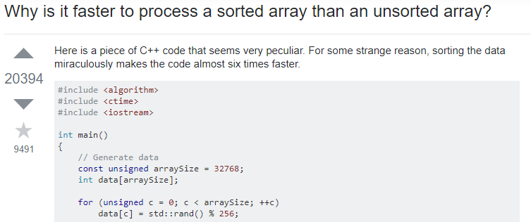
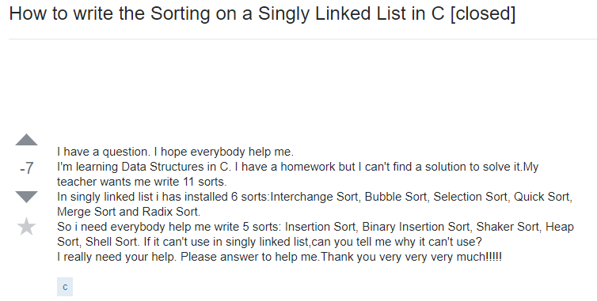

After reading Eric Raymond’s <a href="http://www.catb.org/esr/faqs/smart-questions.html"> How To Ask Questions The Smart Way</a>, I feel that I have learned how to ask better questions on the internet. I also feel that I have learned how to detect not so smart questions. Raymond explained new skills and techniques for everyone to use in order to ask smart questions to get better results or answers. As a software developer, using the internet to ask for help will be a great way to find working on projects. Being able to interact with other developers will allow oneself to learn from them and maybe even give back and teach others. Here we can see a <a href="https://stackoverflow.com/questions/11227809/why-is-it-faster-to-process-a-sorted-array-than-an-unsorted-array"> good question</a> that was asked: 

We can tell this is a good question because it follows the guidelines of Raymond’s essay. First of all, the user was able to show what research or attempts he had at trying to find the answer to his question. He provided code that shows what work he has done in figuring out the solution. He even used another language to further more help him in his research for the answer. The user was able to describe whatever he was looking for in a concise and polite manner to others. You can tell others enjoyed this question through their answer. The top answer given to the user looked well thought out. He even gave a great analogy, it looked like he really enjoyed answering the problem. According to Raymond, good questions usually receive good answers because they others want to answer that question. The person who answered the question seemed to enjoyed the question. He gave a well thought and thorough answer. Thus the user’s question can be identified as a great question. 

On the other hand, here we can see a <a href="https://stackoverflow.com/questions/19794940/how-to-write-the-sorting-on-a-singly-linked-list-in-c"> not so smart question</a>:

Not to belittle the person who uploaded this question, but we can already see from the title that this is a bad question. According to Raymond, better questions have better titles. The title should be very descriptive on the problem in order for others to know what they're dealing with. All you can get from this title is sorting on singly linked list in c. The user does a good job with manners, not being aggressive and thanking others at the end. However, there are much more bad things in this question that make it a not so smart question. First, the user asking the question should do research, and if the user did do research they should include what they found. Second, I feel that saying “this is for homework” or including anything about homework pushes people away from the question. Third, the user asks for an answer, rather than asking for a direction they should look in order to find a solution themselves. Fourth, after reading this question, I get a vibe that the user forgot to do their homework and procrastinated to stack overflow to see if anyone could help him. Reading though the answers, others were able to help the user learn how to ask better questions. The user was pointed in the right direction, given links to sources that talked about how to the sorting algorithm works. Some replies even laughed at the user, telling him that stack overflow was not meant for homework solution, and that they should talk to tutors at their school instead. Raymond’s essay has helped me identify that this is a very bad question. I can learn from this users mistakes and be able to conduct my very own question that I can ask in a great way.

