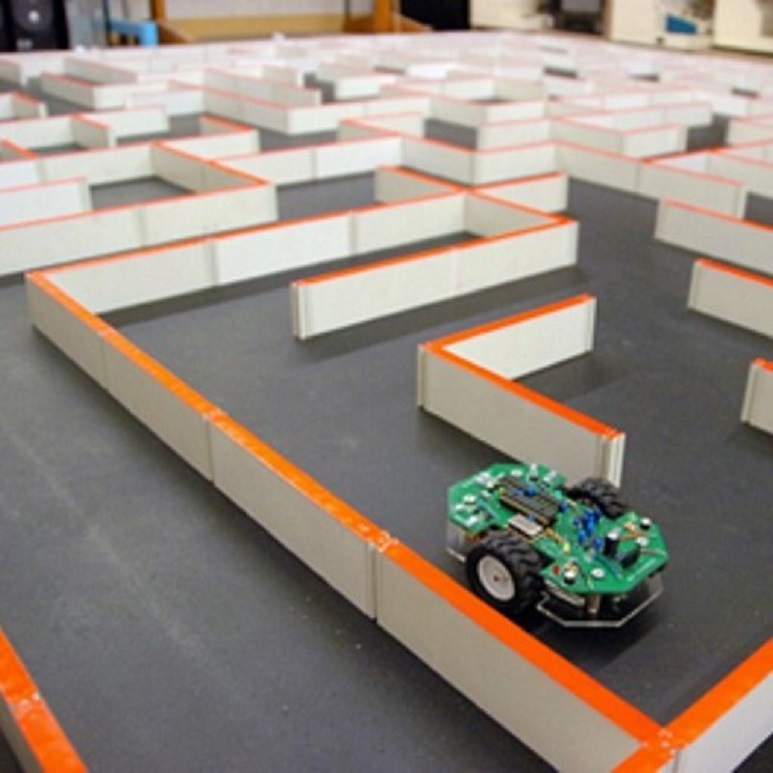
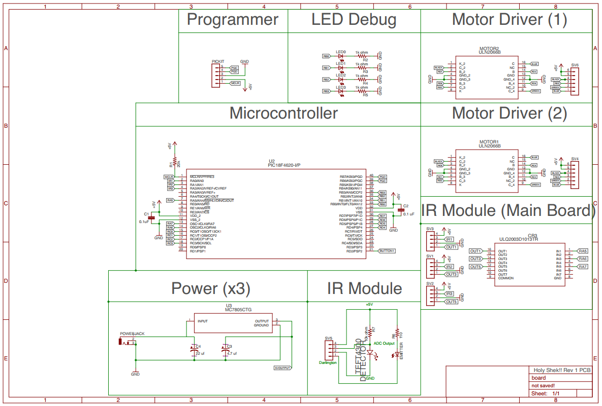

Micromouse is an event where small robot “mice” solve a 16 x 16 maze.  Events are held worldwide.  The maze is made up of a 16 by 16 grid of cells, each 180 mm square with walls 50 mm high.  The mice are completely autonomous robots that must find their way from a predetermined starting position to the central area of the maze unaided.  The mouse will need to keep track of where it is, discover walls as it explores, map out the maze and detect when it has reached the center.  having reached the center, the mouse will typically perform additional searches of the maze until it has found the most optimal route from the start to the center.  Once the most optimal route has been determined, the mouse will run that route in the shortest possible time.

In this project, my main job was mainly in the programming aspect. However, I did help with measuring the frame of our mouse through autoCAD and getting it machined. We used MPLAB X as our IDE and used the Pickit 3 to program our PIC microcontroller. I helped with programming our FloodFill algorithm. We used different algorithms to solve the maze, such as left and right wall huggers, however, floodfill was what we ultimately wanted to use. We completed the FloodFill algorithm and put it in the mouse. We got 2nd place in the UH Fall 2017 competition.

From this project I have learned many team oriented skills. As a team we learned how to split up work to get the project done. Unlike other teams, we were able to get a moving mouse and solve the maze. In this project we had to be able to schedule what needs to be done and fulfill that schedule. Although we fell behind schedule a couple times, we were able to catch up and make up for it. For team oriented skills, I gained experience on how to work with a team, such as communication skills and being able to pull my own work, I learned how to choose my priorities and meet deadlines, and I learned how to contribute to both helping my teammates and learning from them. Micromouse was a great project to help me grow as a Computer Engineer.

You can learn more at the [UH Micromouse Website](http://www-ee.eng.hawaii.edu/~mmouse/about.html).

