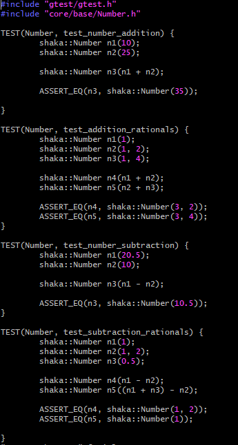

The Shaka Scheme is a scheme to c++ converter. The full Shaka Scheme team consisted of students forming two different teams. The Parsings/IO team and Core Systems team. Parsings/IO took care of the input and output cases for the project. They analyzed whatever came into our interpreter and decided what it was. Parsings/IO focused a lot on the syntax analysis and the organization of the user input. The main source code was tackled by the Core Systems team. They were responsible for data structure and things such as functions and environments. We used GoogleTest to test our code. I was only part of this project for one semester. the very frist semester. However, this project has been going on 3 semesters so far. Many things have changed from when I was in the project.

In this project, I was part of the Parsing/IO team. My main role was to parse in numbers. I dealt with integers, rationals, decimals, etc. I used classes made from the Core Systems team to take whatever number was inputed and identified it to the corresponding class such as integer, rational, etc. The code for integer can be seen below. As said before, I have not been with the project for two semesters so this code may be outdated or edited by someone else. At the end of the time I was a part of the project, we were able to do very simple scheme to c++ interpreting.

	template <typename T>
	bool number_integer(
   	 InputStream&    in,
   	 NodePtr         root,
   	 T&              interm
	) {
		bool accept = false;
		shaka::Token token = in.peek();
	
		if(token.type == Token::Type::NUMBER) {
		
      	  	in.get();
        	interm += token.str;
        	accept = true;
    	}	

		if(checkLimit(token.str) == false) {
			accept = false;
			throw std::out_of_range("Number entered is too large");
		}

  		if (accept == true) {

		root -> push_child(
        	shaka::Number(std::stoi(token.str)));
    		}
   		return accept;
	}

Source: <a href="https://github.com/uhmanoa-transpiler-project/shaka-scheme"><i class="large github icon">
