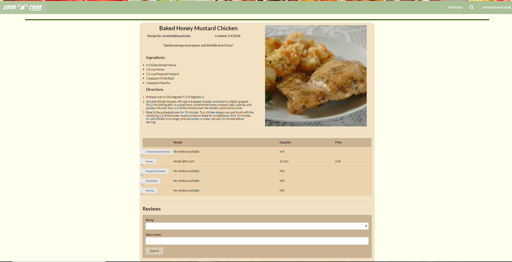
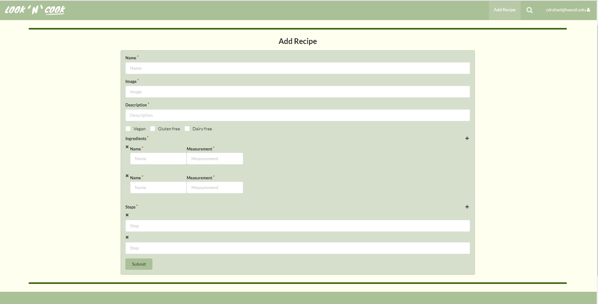

Look 'N' Cook is a small website that allows users to share and view recipes within a community of users. The full team consisted of me and two other students in a Software Engineering class. Look 'N' Cook had multiple functionalities. The main function is to add recipes for other users to view. These recipes would contain basic information such as a description, and image, ingredients, dietary restrictions, and the steps to create the recipe. There would be another type of user, which would be vendors. Vendors were able to establisht their company and create a list of ingredients that are on sale. Students would then be able to view the prices of these ingredients on a page and be able to compare the prices between the different vendors. We also implemented a review section for each recipe. In this section, users are able to comment on other users recipes in addition to addint a rating out of 5 stars on what they think about the recipe.



In my team, we were all software devolopers. So we just divided the tasks by whoever wanted to do it. My major role was to create the collections and schemas. The database we used for this project was MongoDB. I created 3 collections which were recipes, vendors, and reviews. The recipes collection included a schema that contained the name, decription, image, boolean elements for dietary restrictions, an array of ingredients, the date created, the owner's username, and an array of steps. The vendors collection included a schema that contained the name, the quantity, the price, the date created, and the vendor's username. The reviews colection included a schema that contained a selection of rating by stars, the date created, the owner's username, and the actualy review. For all the collections, I created pages and components such as add/edit recipes, add/edit vendor ingredients, and adding reviews. The most difficult time I had was creating the forms for arrays in order for the user to input the needed information. As a team we had multiple ideas of how to implement the array for ingredients in the recipes collection. We thought about having the ingredients as a different collection which included the recipe's unique idea, or even having the recipe's hold an array of all the ingredient's unique id. Ultimately, we settled with having an array of ingredient objects within the recipe collection and it worked fairly well. Below is a snip of code for the recipe schema. Another contribution I had in this website was the vendor sign up page. I created the page that allows users to register as vendors which would give them the role as a vendor, thus having a different interface then regular users. 

```
const RecipeSchema = new SimpleSchema({
  name: String,
  image: String,
  description: String,
  vegan: {
    type: Boolean,
    required: false,
  },
  glutenFree: {
    type: Boolean,
    required: false,
  },
  dairyFree: {
    type: Boolean,
    required: false,
  },
  ingredients: {
    type: Array,
    minCount: 1,
  },
  'ingredients.$': {
    type: Object,
  },
  'ingredients.$.name': {
    type: String,
  },
  'ingredients.$.measurement': {
    type: String,
  },
  steps: {
    type: Array,
    minCount: 1,
  },
  'steps.$': {
    type: String,
  },
  owner: String,
  createdAt: Date,
}, { tracker: Tracker });
```

In the end, I feel that we were able to get a lot done and that the website is very usable and well done. There were still a couple functions we were not able to implement, such as, having a function to add up the cheapest ingredients by the vendors to calculation the cheapest price, having a function that calculates the average ratings of a recipe, only allowing UH emails to be registered, or having a function that verifies vendors. However, with the functionality Look 'N' Cook has right now, im very proud of it. The final project allowed me to be more exposed with software development, working with a small team via github, and honing various communication, planning, and organization skills.

Source: <a href="https://look-n-cook.github.io/"><i class="large github icon"></i>Look 'N' Cook Documentation</a>
Website: <a href="http://look-n-cook.meteorapp.com/#/">Look 'N' Cook</a>
